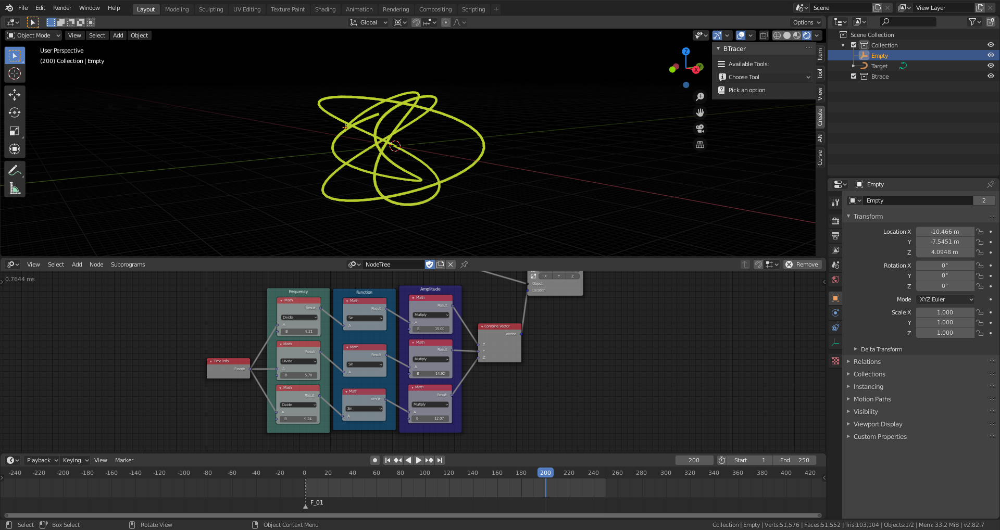
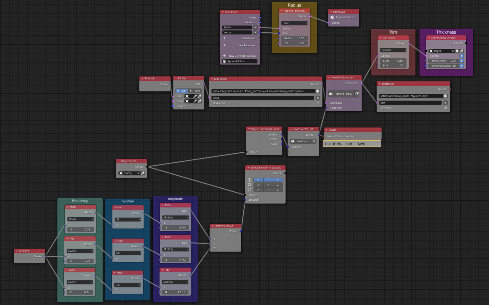

# Animation Nodes Lissajous
Blender program to create realtime lissajous curves using [Animation Nodes](https://github.com/JacquesLucke/animation_nodes) and the Jimmy Gunawan's [custom version](https://github.com/enzyme69/blendersushi/issues/605) of the [Omar Emara solution](https://blender.stackexchange.com/questions/105090/how-to-store-particle-locations-in-a-list/105178) to create splines from particles location.

## Other links
- [Jimmy Gunawan LIVENODING](https://www.youtube.com/watch?v=1Ac0SKjx1FI)
- [Other AN lissajous generator](https://www.youtube.com/watch?v=X-4PFcTjPh4)
- [About lissajous curves](https://en.wikipedia.org/wiki/Lissajous_curve)

